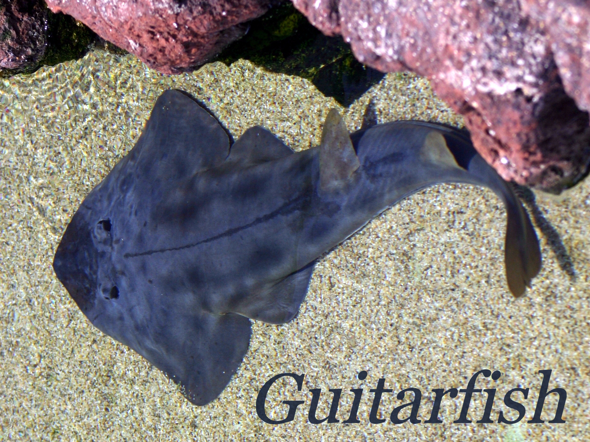

Guitarfish (5.3.29@6.4) is an open-source UCI-compliant chess engine written in Python, featuring a custom 64-bit bitboard move generator accelerated by Numba JIT and an evaluation function powered by an INT8 neural network (Custom NNUE).

---

## Play on Lichess

Guitarfish runs live as an official bot on Lichess: [@guitarfish-engine](https://lichess.org/@/guitarfish-engine).

- **Rapid Rating:** ~2000 ELO
- **Blitz Rating:** ~1800 ELO
- **Challenge Policy:** Currently configured to accept **Blitz** and **Rapid** challenges only.

> **Note:** The engine is self-hosted on a local machine. If the bot is offline or not responding, the server is likely turned off while the author is away at school =)))

---

## About the Name

The engine is named after the **guitarfish** (*Rhinobatidae*), a real family of rays characterized by a flattened body and an elongated snout resembling an acoustic guitar.

---

## Features

- **Engine Core:** Custom 64-bit bitboard implementation compiled to native machine code using Numba JIT.
- **Evaluation:** Custom NNUE architecture with 1,729 board features (Piece-Square tables, Combat Maps, King Safety zones, and Pawn Phalanxes/Chains), quantized to INT8 for CPU inference.
- **Search Algorithm:** Negamax with Principal Variation Search (PVS) and Alpha-Beta pruning.
- **Pruning & Reductions:**
  - Singular Extensions (SE)
  - Null Move Pruning (NMP)
  - Reverse Futility Pruning (RFP)
  - Futility Pruning (FP)
  - Late Move Pruning (LMP)
  - Dynamic Late Move Reductions (LMR)
  - Static Exchange Evaluation (SEE) pruning in Quiescence Search
- **Move Ordering:**
  - Transposition Table (TT) move
  - Good captures sorted by MVV-LVA and SEE
  - Killer moves (2 slots per ply)
  - Countermove heuristic
  - History heuristic with aging
  - Losing captures demoted below quiet moves
- **Transposition Table:** 64-bit PolyGlot Zobrist hashing with mate-distance ply adjustments.
- **Opening Book:** Native PolyGlot (`.bin`) binary search support.
- **Model Packaging:** Single `.gm` archive containing model weights, ONNX runtime graph, and metadata loaded directly from memory.

---

## Architecture Overview

### 1. Neural Network Evaluation

| Component | Specification |
| :--- | :--- |
| **Input Features** | 1,729 sparse geometric features (up to 256 active per position) |
| **Feature Transformer** | Dual accumulator ($2 \times 1024 \rightarrow 2048$), separate White/Black perspectives |
| **Hidden Layers** | Linear($2048 \rightarrow 1024$) $\rightarrow$ Linear($1024 \rightarrow 256$) $\rightarrow$ Linear($256 \rightarrow 64$) |
| **Activation** | SCReLU ($\text{clamp}(x, 0, 1)^2$) |
| **Output** | Linear($64 \rightarrow 1$) mapped to centipawns via WDL scaling |
| **Training Dataset** | 17.6M deduplicated, quiet positions |
| **Loss Function** | Dual Loss: $0.5 \times \text{BCE}(\text{WDL}) + 0.5 \times \text{Huber}(\text{Centipawns})$ |

### 2. Move Generation Benchmark

Perft test on the standard starting position:

| Library | Depth | Nodes | Time | Speed |
| :--- | :--- | :--- | :--- | :--- |
| `python-chess` (baseline) | 4 | 197,281 | 1.83 s | ~108,000 NPS |
| **`custom bitboard` (Numba JIT)** | 4 | 197,281 | 0.034 s | **~5,720,000 NPS** |

---

## Requirements

- Python 3.9 or higher
- NumPy
- Numba
- ONNX Runtime

Install dependencies via `pip`:

```bash
pip install -r requirements.txt
```

---

## Installation & Usage

Clone the repository:

```bash
git clone https://github.com/memeviber/guitarfish-chess-engine.git
cd guitarfish-chess-engine
```

### Running the UCI Engine

Launch the engine via command line:

```bash
python guitarfish.py guitarfish.gm book.bin
```

Standard UCI commands example:

```text
uci
isready
position startpos moves e2e4 e7e5
go depth 10
```

The engine outputs standard UCI search information (`depth`, `seldepth`, `score`, `nodes`, `nps`, `pv`) and terminates with `bestmove`.

---

## Lichess Bot Integration

Guitarfish is compatible with [`lichess-bot`](https://github.com/ShailChoksi/lichess-bot).

Example `config.yml` snippet:

```yaml
engine:
  dir: "./"
  name: "python"
  arguments:
    - "guitarfish.py"
    - "guitarfish.gm"
    - "book.bin"
  protocol: "uci"
  ponder: false
```

---

## Acknowledgments

- **Image Credit:** Shovelnose guitarfish photo by [Jot Powers](https://commons.wikimedia.org/wiki/File:Shovelnose_guitarfish.JPG), color-adjusted by Togabi via Wikimedia Commons, licensed under [CC BY-SA 2.0](https://creativecommons.org/licenses/by-sa/2.0/), further edited by [memeviber](https://github.com/memeviber).
- **AI Assistance:** This engine was developed with the assistance of Gemini, accelerating algorithmic design, debugging, and overall development speed by an estimated 16x.

---

## License

This project is open-source and available under the [Apache License 2.0](LICENSE).